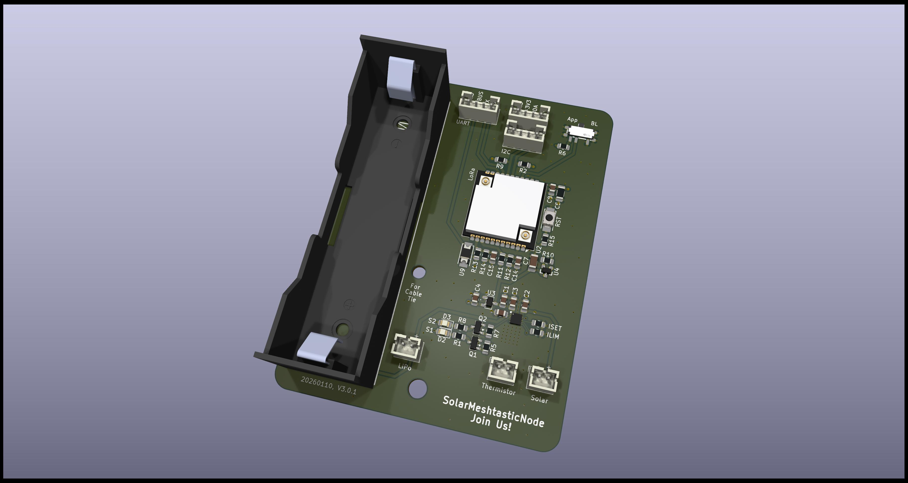

**Informations:** 

The successor of this project is now in its very early development stages: [LoRaPowerBox](https://github.com/h0lad/LoRaPowerBox).

There is also a miniaturized version of this PCB: [SolarMeshtasticNodeMini](https://github.com/h0lad/SolarMeshtasticNodeMini).

---

## What is this thing?

This is a Meshtastic solar node based on the [Heltec HT-CT62](https://resource.heltec.cn/download/HT-CT62/HT-CT62(Rev1.1).pdf) and the (new) linear solar charge controller [TI BQ25185](https://www.ti.com/lit/ds/symlink/bq25185.pdf).

Features of this PCB

 - Solar Input up to 18V (24V survival)
 - 3A maximum load
 - 1A maximum charge current
 - Pseudo-MPPT (VINDPM)
 - Power Path (= if the battery is fully charged and there's enough solar power the device is getting powered directly from solar. During sunrise and sunset it can mix the sources.)
 - Two ADC signals for getting VLOAD and  VBUS voltage using voltage dividers
 - 3.7V LiPo either via 18650 block or JST-PH 2.0 connector
 - Low power LDO [HEERMICR HE9073A30MR](https://www.lcsc.com/datasheet/lcsc_datasheet_2304140030_HEERMICR-HE9073A30MR_C723792.pdf)
 - Brown-out Reset IC ([Diodes Incorporated APX803L05-32SA-7](https://wmsc.lcsc.com/wmsc/upload/file/pdf/v2/lcsc/2304140030_Diodes-Incorporated-APX803L05-32SA-7_C2067928.pdf)) at 3.2V which senses the voltage *before* the LDO 

Combined with a solar panel this device can be placed in remote areas to cover a wide range.

*If you want to use the Reset IC*

Do not bridge the "EN" pin headers. The signal of this IC is "weak" -  it can be overruled by a jumper without destroying the board.

# Where can I get all the stuff?

Heltec HT-CT62: Aliexpress

TI BQ25185: Mouser or Digikey

PCB: You can load the Kicad project file and then export the manufacturing files using the plugins. Just throw them into JLCPCB and order them.

Everything else can be ordered from LCSC.

Due to strict legislation, it is not planned to offer ready-made circuit boards or kits here. Sorry.

# Meshtastic, ESP32 and Power Saving. How?

*Warning 1* 

By enabling "Power Saving" you will loose *all* regular telemetry (Sensors, Battery Voltages, etc.)! The battery voltage can be polled manually using the Python lib.

I reported this a bug but it was rejected.

*Warning 2* 

You also will not be able to configure it by serial port anymore! You have a short period after power cycling it. Use the "meshtastic" Python script as it waits for a while.

### Router Role

1. Enable "Power Saving" (is activated by default if using Router role)

2. When configuring the device you should set the "Minimum Wake Interval" from 10 seconds to 1 second.

3. Switch Bluetooth and Wifi off! They suck power like crazy.

### Client Role

This is more tricky as per default it doesn't switch into "Light Sleep" as several delays are blocking it.

You also have to decrease "Wait Bluetooth Seconds" and "Screen on Seconds" to 1 second.

Then configure is like a "Router".

# Do I have to modify the Software and configuration?

I'm keeping a more or less outdated branch von the Meshtastic firmware on `git@github.com:dm5tt/meshtastic-firmware.git` in the branch `solarmeshtasticnode`. If you want a fresher version you must rebase it yourself.

# Evaluation

[Evaluation, PCB v0.2 (CR123A)](./EVALUATION-v02.md)

[Evaluation, PCB v2.0.0 (18650)](./EVALUATION-v200.md)

# FAQ

*The HT-CT62 uses a ESP32C3. Thats not Low Power!!!*

Meshtastic  supports the "Power Saving" mode on the ESP32 where the entire   device stays  in the light sleep mode until it gets a interrupt signal from the LoRa modem. In that phase CPU will consume around ~800uA while sleeping.  

Permanent active LoRa RX from the Semtech modem will always cause a consumption of 7-8mA. Not even a STM32 or Nordic can get rid of this. 

Much less power consumption could be achieved in a sensor scenario where permanent RX is not required: there the worst-case is most likely determined by the current draw of the sleeping microcontroller and component leakage.

Warning, again: switching on BLE or even Wifi will make the ESP32 burn a crazy amount of energy. 

For sunny regions (Portugal, Spain, etc.) a 6V panel is enough. For central Europe (like Germany) a 12V or higher solar panel is recommended for surviving the winter.

*It's not really that cheap either!*

Yep. It's expensive if you build only 1 device. But the costs dramatically drop if think of building 5-10 of them as you can mass order everything (PCBs, Components from LCSC and so own).

*The TI BQ25185 uses a linear regulator to create the voltage before the LDO. That will be inefficient for solar panels above 6V.*

Yes. It's very inefficient if it's running with the power path enabled (= direct solar pass-through) as the device has to burn off a lot of voltage from the panel. During battery runtime the difference is way lower which is acceptable.

It maybe cause unneccesary heat during the winter time where small 18V solar panels would be a great benefit. But for 6V panels it's a within acceptable ranges.

I'm planing to build a new generation of the SolarMeshtasticNode with the upcoming [TI BQ25630](https://www.ti.com/lit/ds/symlink/bq25630.pdf?ts=1755932677893). It has an integrated ADC (which allows us to get rid of all power dividers) and also has a  very efficient DC DC buck architecture. Price wise it will be around $2 which is still very acceptable.

*Why are you using a 3.0V and not a 3.3V LDO?*

This gives us more runtime by only loosing 1-2dB TX power from the LoRa module.  

With a 3.3V LDO the device will switch off around ~3.5V - with 3.0V LDO it can survive down to 3.2V.

# Warning

LED circuit for STAT1 and STAT2 aren't tested. The TI BQ25185 uses 1.8V for the status pins so the LEDs must be switched via a transistor against the 3.3V supply voltage.

# License

CERN OHL v2 – Strongly Reciprocal (S)
